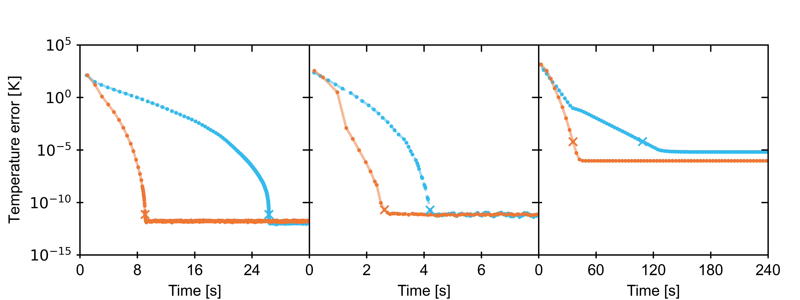
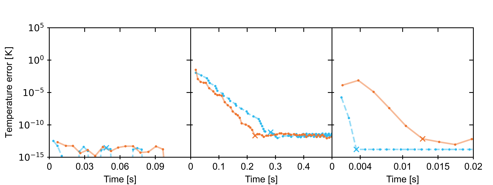
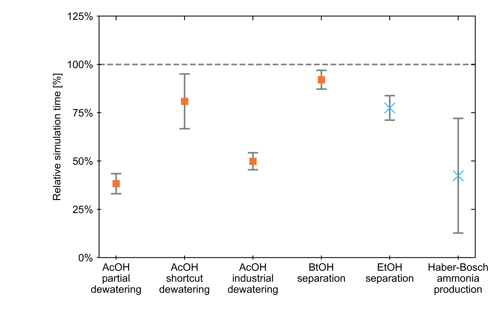

# Flowsheet Simulation Benchmarks

This module contains flowsheet benchmarking systems for BioSTEAM. Currently,
only convergence profiling for sequential modular and phenomena-based simulation
algorithms have been implemented. In the future, tests for detailed stream results
for all systems will become available.

Getting started
---------------

After installing Python 3.12, run the following command in your terminal or 
command line:

```
$ pip install BioSTEAM-Benchmarks==0.0.0
```

View registered systems for benchmarking as follows:

```python
>>> import benchmark
>>> benchmark.all_systems.keys()
dict_keys(['acetic_acid_simple', 
           'acetic_acid_complex_decoupled', 
           'acetic_acid_complex', 
           'butanol_purification', 
           'ethanol_purification',
           'haber_bosch_process'])
```

Generate convergence profiles: 

```python
>>> import benchmark
>>> benchmark.plot_profile(
...     systems=['acetic_acid_simple', 
...              'acetic_acid_complex_decoupled', 
...              'acetic_acid_complex'],
...     N=5, 
...     load=True, # Use False to rerun simulations
... )
```


```
>>> import benchmark
>>> benchmark.plot_profile(
...     systems=['ethanol_purification', 
...              'butanol_purification', 
...              'haber_bosch_process'],
...     N=5, 
...     load=True, 
... )
```


Plot relative convergence results with orange squares being the relative convergence time of the phenomena-based to the sequential modular algorithm and blue Xs vice-versa:

```
>>> import benchmark
>>> plot_benchmark(N=5, load=True) # set load=False to rerun simulations
```

